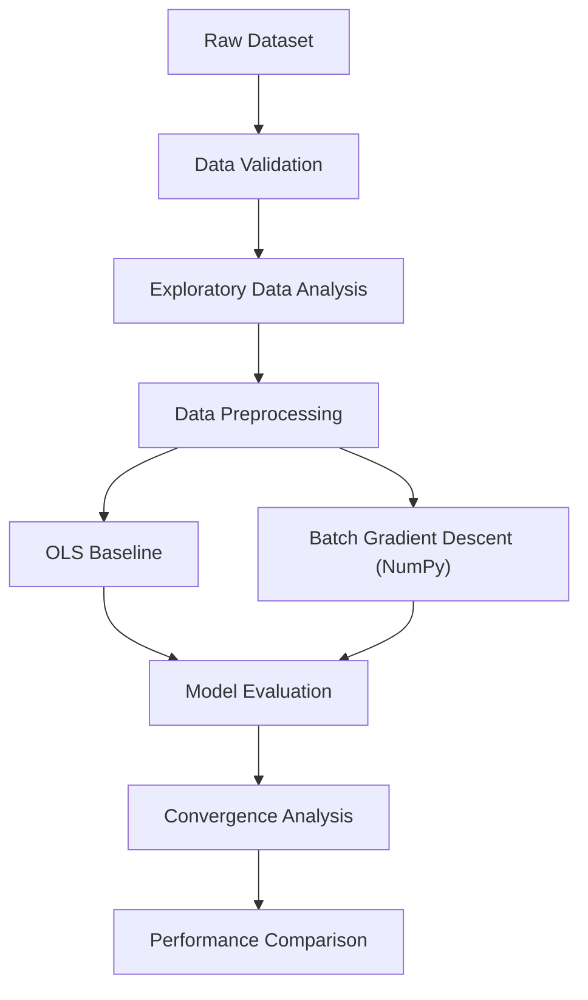

# Linear Regression Optimization Lab

### Implementing Linear Regression from Scratch Using NumPy

A hands-on machine learning project exploring the mathematical foundations, implementation, optimization, and evaluation of Linear Regression using **Ordinary Least Squares (OLS)** and **Batch Gradient Descent (BGD)**.

The project uses the Ames Housing dataset to study how optimization algorithms learn model parameters, how learning rates affect convergence, and how preprocessing influences model performance.

---

## Table of Contents

- [Project Overview](#project-overview)
- [Dataset](#dataset)
- [Machine Learning Concepts Covered](#machine-learning-concepts-covered)
- [Project Workflow](#project-workflow)
- [Project Structure](#project-structure)
- [Methodology](#methodology)
- [Results](#results)
- [Installation and Setup](#installation-and-setup)
- [Key Learnings](#key-learnings)
- [Limitations](#limitations)
- [Future Improvements](#future-improvements)
- [Technologies Used](#technologies-used)

---

## Project Overview

Linear Regression is one of the fundamental algorithms in machine learning. While libraries such as Scikit-learn provide optimized implementations, understanding the underlying mathematics and optimization process is essential for developing strong ML engineering skills.

This project implements Batch Gradient Descent from scratch using NumPy and compares its behavior against a Scikit-learn Ordinary Least Squares baseline.

The project follows a reproducible workflow covering data validation, exploratory data analysis, preprocessing, model training, evaluation, and experimental analysis.

### Key Objectives

- Understand the mathematical formulation of Linear Regression.
- Implement Batch Gradient Descent using NumPy.
- Understand gradients, cost functions, learning rates, and convergence.
- Establish an Ordinary Least Squares baseline using Scikit-learn.
- Build reusable preprocessing and evaluation modules.
- Compare training and validation performance.
- Analyze optimization behavior through loss curves and prediction errors.
- Follow modular coding and reproducible experimentation practices.

---

## Dataset

**Dataset:** House Prices - Advanced Regression Techniques

**Source:** [Kaggle House Prices Competition](https://www.kaggle.com/competitions/house-prices-advanced-regression-techniques)

The dataset contains residential property characteristics used to predict the final sale price of houses in Ames, Iowa.

### Dataset Files

| File        | Description                                                    |
| ----------- | -------------------------------------------------------------- |
| `train.csv` | Training observations with the target variable `SalePrice`     |
| `test.csv`  | Test observations without the target variable                  |

> [!NOTE]
> The Kaggle test dataset is kept separate from model validation. Model performance is evaluated using a validation split derived from the training dataset.

---

## Machine Learning Concepts Covered

### Linear Regression

The model predicts a continuous target using a linear combination of input features.

$$
\hat{y} = Xw + b
$$

Where:

- $X$: Feature matrix
- $w$: Weight vector
- $b$: Bias
- $\hat{y}$: Predicted target

### Ordinary Least Squares

OLS estimates model parameters by minimizing the sum of squared residuals.

$$
J(w, b) = \frac{1}{m} \sum_{i=1}^{m} \left( \hat{y}_i - y_i \right)^2
$$

The OLS baseline is implemented using Scikit-learn's `LinearRegression`.

### Batch Gradient Descent

Batch Gradient Descent minimizes the cost function through iterative parameter updates, using gradients computed over the entire training dataset.

**Weight gradient:**

$$
\frac{\partial J}{\partial w} = \frac{2}{m} X^{T} \left( Xw + b - y \right)
$$

**Bias gradient:**

$$
\frac{\partial J}{\partial b} = \frac{2}{m} \sum_{i=1}^{m} \left( \hat{y}_i - y_i \right)
$$

**Parameter updates:**

$$
w := w - \alpha \frac{\partial J}{\partial w}
$$

$$
b := b - \alpha \frac{\partial J}{\partial b}
$$

Where $\alpha$ is the learning rate.

The implementation uses NumPy for matrix operations and parameter updates.

---

## Project Workflow



---

## Project Structure

```text
linear-regression-optimization-lab/
├── README.md
├── requirements.txt
├── .gitignore
│
├── data/
│   ├── raw/
│   └── processed/
│
├── notebooks/
│   ├── 01_data_validation.ipynb
│   ├── 02_eda.ipynb
│   ├── 03_preprocessing.ipynb
│   ├── 04_ols_baseline.ipynb
│   └── 05_batch_gradient_descent.ipynb
│
├── src/
│   ├── __init__.py
│   ├── linear_regression/
│   │   ├── __init__.py
│   │   ├── bgd.py
│   │   └── evaluation.py
│   └── preprocessing/
│       ├── __init__.py
│       └── prepare_data.py
│
├── experiments/
│
└── reports/
    └── figures/
```

---

## Methodology

### 1. Data Validation

- Inspect dataset dimensions and data types.
- Identify missing values.
- Check duplicate observations.
- Analyze numerical and categorical features.
- Inspect target distribution and summary statistics.

### 2. Exploratory Data Analysis

- Analyze the distribution of `SalePrice`.
- Investigate numerical feature relationships.
- Examine categorical feature patterns.
- Analyze correlations.
- Identify potential outliers and skewed distributions.

### 3. Data Preprocessing

| Feature Type | Processing               |
| ------------ | ------------------------ |
| Numerical    | Median imputation        |
| Numerical    | Standardization          |
| Categorical  | Missing-value imputation |
| Categorical  | One-hot encoding         |

> [!IMPORTANT]
> The preprocessing pipeline is fitted **only on the training split** and then applied to the validation data to prevent data leakage.

### 4. OLS Baseline

Scikit-learn's `LinearRegression` provides the reference model against which the custom BGD implementation is evaluated.

### 5. Batch Gradient Descent

The custom implementation includes:

- Weight and bias initialization.
- Prediction calculation.
- Mean Squared Error cost function.
- Analytical gradient computation.
- Learning-rate-based parameter updates.
- Loss tracking across iterations.

### 6. Model Evaluation

| Metric | Purpose                        |
| ------ | ------------------------------ |
| MAE    | Mean Absolute Error            |
| MSE    | Mean Squared Error             |
| RMSE   | Root Mean Squared Error        |
| R²     | Coefficient of Determination   |

Both training and validation performance are considered.

---

## Results

Final experimental results will be documented after validating the completed experiments.

| Model      | Training R²     | Validation R²   | Validation RMSE |
| ---------- | --------------- | --------------- | --------------- |
| OLS        | To be finalized | To be finalized | To be finalized |
| Custom BGD | To be finalized | To be finalized | To be finalized |

The comparison will also consider convergence behavior, learning-rate sensitivity, and prediction errors.

### Visual Analysis

The final report will include:

- Target variable distribution.
- Correlation heatmap.
- Gradient Descent loss curve.
- Actual vs. predicted house prices.
- Residual analysis.
- OLS and BGD performance comparison.

---

## Installation and Setup

### Prerequisites

- Python 3.10+
- NumPy
- Pandas
- Scikit-learn
- Matplotlib
- Seaborn

### 1. Clone the repository

```bash
git clone <your-repository-url>
cd linear-regression-optimization-lab
```

### 2. Create a virtual environment

**macOS / Linux:**

```bash
python3 -m venv .venv
source .venv/bin/activate
```

**Windows:**

```powershell
python -m venv .venv
.venv\Scripts\activate
```

### 3. Install dependencies

```bash
pip install -r requirements.txt
```

### 4. Download the dataset

Download the Kaggle competition dataset and place the files in:

```text
data/raw/
├── train.csv
└── test.csv
```

### 5. Run the notebooks

Open the notebooks in your preferred IDE or notebook editor and execute them in sequence.

---

## Key Learnings

This project provides practical experience with:

- Mathematical foundations of Linear Regression.
- Vectorized numerical computation using NumPy.
- Analytical gradient derivation.
- Optimization and convergence behavior.
- Learning-rate selection and numerical stability.
- Feature scaling and preprocessing pipelines.
- Model evaluation and error analysis.
- Reusable Python modules.
- Reproducible ML experimentation.

---

## Limitations

- The current project focuses on OLS and Batch Gradient Descent.
- Model performance is based on a particular training-validation split.
- Further validation across multiple splits would provide stronger evidence of generalization.
- Regularization methods and alternative optimization algorithms are not yet included.
- Hyperparameter tuning and computational benchmarking remain potential extensions.

---

## Future Improvements

- Implement Stochastic Gradient Descent.
- Implement Mini-Batch Gradient Descent.
- Explore Ridge and Lasso Regression.
- Compare convergence rates across optimization methods.
- Perform cross-validation.
- Develop a reusable experiment runner.
- Add prediction support for unseen observations.
- Extend the project with a model inference interface.

---

## Technologies Used

- **Python** — Core programming language
- **NumPy** — Numerical computation and custom optimization
- **Pandas** — Data manipulation
- **Scikit-learn** — Baseline model, preprocessing, and evaluation
- **Matplotlib** — Visualization
- **Seaborn** — Exploratory data analysis
- **Jupyter Notebooks** — Interactive experimentation